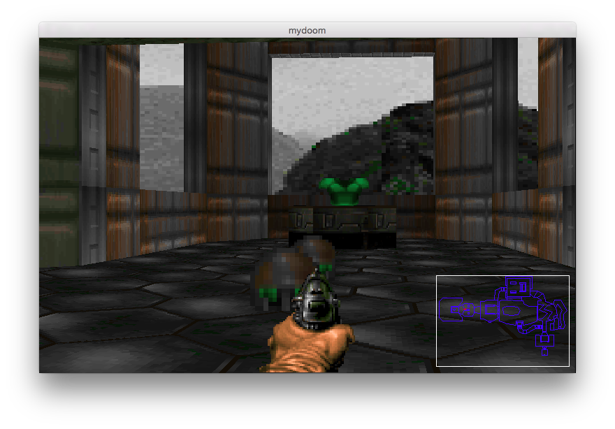

# My Doom

An in-progress, partial reimplementation in C++ of the original Doom, from scratch. 

## Why?

For fun. And nastolgia. 

## Why from scratch? 

To better understand its algorithms. The original implementation is excessively difficult to understand because it is so impressively optimized. Modern computers have so much more horsepower that it is possible to reimplement cleanly, without all the optimization, thereby better exposing the beauty of the core algorithms

## Usage

This version compiles & runs on OS X 10.0, with clang++.

All you gotta do is:

1. find a WAD file (google it)
2. stick it in 'data/'
3. Run 'make clean; make'
4. Run './mydoom -f data/doom_ultimate.wad' # or whatever your WAD file is

